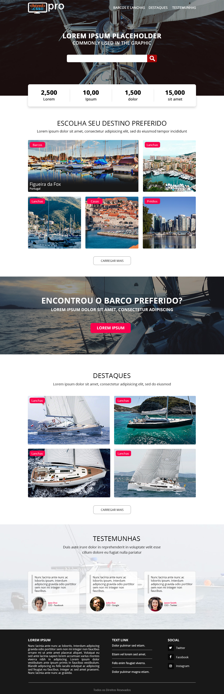

# Trabalhando com HTML, CSS e JavaScript.

## Layout desenvolvido para apresentação no curso de pós em Desenvolvimento WEB e Mobile.
## Linguagem HTM5 / JS / CSS / fontawesome

## Layout pretendido.

### Etapa 1:
- [x] Iniciar a estrutura do layout (HTML e CSS).
- [x] Criar menu e topo com estatisticas responsivel

### Etapa 2:
- [x] Desenvolver seção de destinos
- [x] Estilizar boxes Destino.

### Etapa 3:
- [x] Criação do Paralax
- [x] Estilizar Paralax

### Etapa 4:
- [x] Criação seção Destaques
- [x] Estilizar Destaques

### Etapa 5:
- [x] Criação seção Testemunhas
- [x] Estilizar Testemunhas

### Etapa 6:
- [] Criação do Footer
- [] Estilizar Footer

